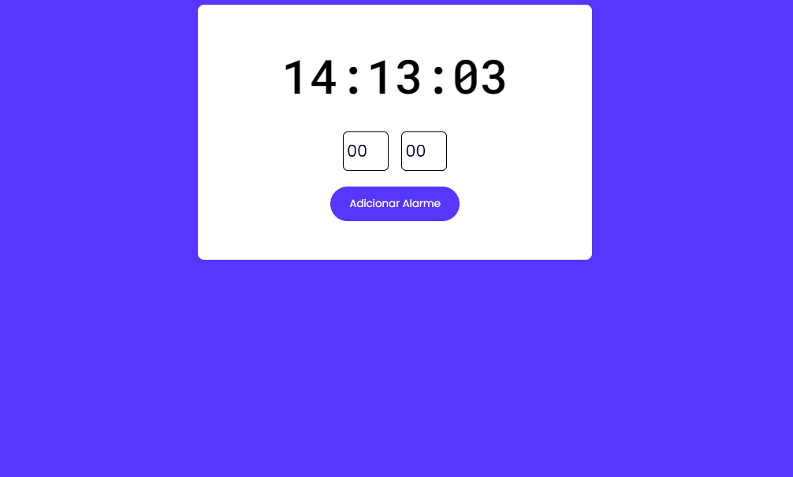

## 🧾 Descrição

O projeto Alarme é uma aplicação web que permite adicionar e configurar alarmes para notificar o usuário em horários específicos. Ele possui uma interface simples e intuitiva, que permite adicionar alarmes especificando a hora e o minuto desejados. Quando o alarme é ativado, ele é adicionado a uma lista de alarmes ativos na interface, e uma contagem regressiva é iniciada no cronômetro. Quando a contagem regressiva chega a zero, um alarme sonoro é emitido para alertar o usuário. 

<h1>

## 🔌 Tecnologias utilizadas

- **HTML:** linguagem de marcação usada para estruturar e apresentar o conteúdo da página;
- **CSS:** linguagem de estilo usada para estilizar a página, incluindo layout, fontes, cores, etc;
- **JavaScript:** Linguagem de programação que permite criar interações dinâmicas na web. Com ela é possível manipular o conteúdo HTML e CSS em tempo real, validar formulários, criar animações, entre outras possibilidades.
- **Font Awesome Icons (CDN):** Biblioteca de ícones vetoriais em escala que pode ser personalizada com CSS.
- **Google Fonts (CDN):** Serviço que disponibiliza uma coleção de fontes para uso na web, otimizadas para carregamento rápido.

## ⚙️ Estrutura

- **img:** Contém imagens utilizadas no projeto e para apresentação no Readme.md;
- **song:** Arquivo MP3 "Cuco", alarme de exemplo que coloquei para execução do toque do alarme;
- **index.html:** Contém a linguagem de marcação usada para estruturar e apresentar o conteúdo da página;
- **style.css:** Contém regras de estilo que são usadas para personalizar a aparência da página HTML. Ele inclui configurações de fonte, cor de fundo, posicionamento e tamanho de elementos, e outras propriedades de estilo para tornar a página mais atraente e fácil de usar.
- **script.js:** Responsável por todas as funcionalidades e interações do usuário. Ele manipula o DOM para exibir e atualizar a interface do usuário, armazena e gerencia as informações do alarme em um array, manipula o áudio do alarme e implementa a lógica do temporizador que exibe a hora atual e aciona os alarmes definidos pelo usuário.

## 🏳️ Como executar?

### **Passo 1**
Faça download do repositório

### **Passo 2**
Abra o arquivo "Index.html" em um navegador e teste as funções.

 

## ✅ Resultado (Preview)

### **Alarme**

 

## 💻 Autor: Luan Ferreira

Portfólio:
- [Github](https://github.com/fluanbrito)

Contato:
- [Linkedin](https://www.linkedin.com/in/luanferreirab/)

<h1>

## 🚀 Sobre mim
Sou um grande entusiasta e apaixonado por tecnologia, empreendedorismo e inovação. Hoje, estou a cursar o curso de Sistema de Informação pelo Instituto Federal, faço uso profissionalmente de ferramentas e me aprofundo em temas como Marketing, Machine Learning AWS, Metodologias ágeis, Gestão de Projetos, Programação Web, Administração de Sistemas, Redes de computadores, entre outros.
